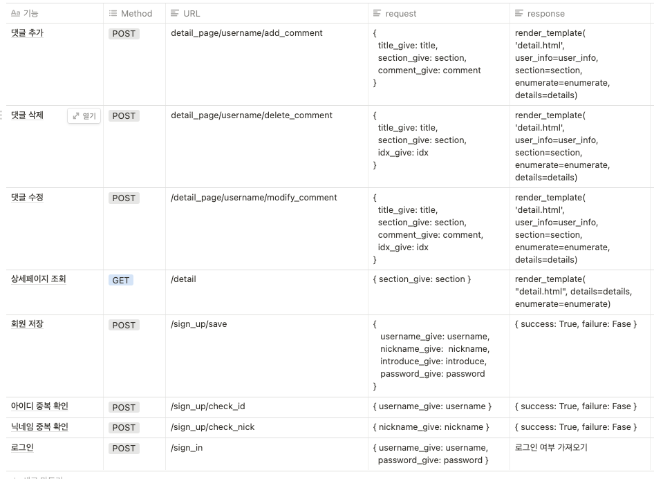

# README

## 💪🏻 프로젝트 소개

- 올해의 핫키워드 "득근". 아직도 혼자서 운동하시나요?  운동피드를 서로 공유하기도 하며 부위별 추천 영상을 통해 유튜브 전문가들을 만나면서  본인의 운동으로 만들어보세요!

## 🚴🏻 구성

- 로그인(/templates/login.html)
- 회원가입(/templates/member.html)
- 메인-운동피드 공유 및 프로필 수정(/templates/user.html)
- 상세-유튜브 크롤링 및 댓글(/templates/detail.html)

## 🌅  프로젝트 기간

21.09.13 ~ 21.09.17(5일간)

## 🤽🏻‍♂️ 팀 구성

- 윤승근([https://github.com/thelapssql0](https://github.com/thelapssql0))
- 이종찬([https://github.com/qkskfka](https://github.com/qkskfka))
- 류은설([https://github.com/eunseolryu](https://github.com/eunseolryu))
- 나종완([https://github.com/jongwanra](https://github.com/jongwanra))

## 🏃🏻‍♂️ 구현 기능

- 로그인/로그아웃
- 회원가입
- 유튜브 크롤링
- CRUD(본인 댓글만 수정 삭제 가능)

## ⌨️ 기술 스택

### Front-end

- HTML/CSS/JavaScript

### Back-end

- Python
- Jinja2
- Flask
- MongoDB

## 🖥️ API

 

## 🔎 VENV

- 가상환경은 requirements.txt 확인

## ⭐️  웹페이지 링크

- [득근 코스(http://deukgeun.shop)](http://deukgeun.shop)

## 🍎  유튜브 링크

- [https://youtu.be/gtPpQwsxiS8](https://youtu.be/gtPpQwsxiS8)
